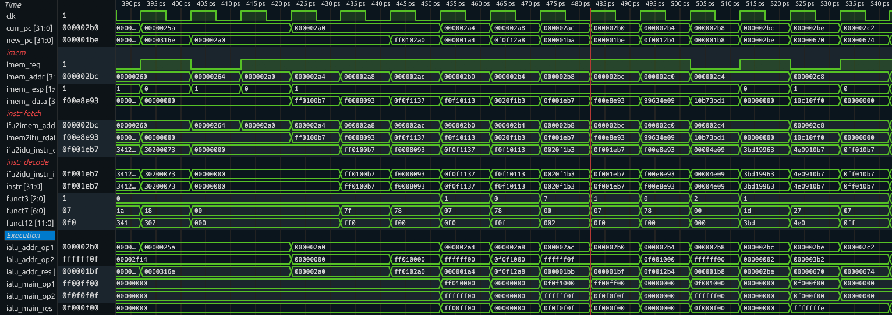

# Отчет по лабораторной работе №3

## Архитектура конвеера SCR1

## Цель работы

Познакомиться с архитектурой пайплайна SCR1. Доработать тестбенч для вывода информации об микроархитектурном состоянии и состоянии конвеера при выполении определенной команды.

## Ход работы

Запустить тест на проверку инструкции `and` командой:

```
make run_verilator_wf TARGETS="riscv_isa" TRACE=1
```

Данная команда создает `.vcd` файл, содержащий временную диаграмму всех сигналов процессора. Выведем следующие сигналы:  
- `clk`
- `curr_pc`
- `imem_req`
- `imem_addr`
- `imem_resp`
- `imem_rdata`

Дополнительно были выведены сигналы отражающие работу стадий конвейера. Временная диаграмма представлена на следующем рисунке.



Также в верификационное окружение был добавлен несинтезируемый блок, который проверяет запрашиваемую из памяти инструкцию и выводит в консоль сообщение, если обнаруживает нужную инструкцию.

Код блока:

```Verilog
module scr1_and_instr_mon(
  input logic clk,
  input logic imem_resp,
  input logic [32-1:0] imem_rdata
);

always_ff @( posedge clk ) begin 
  if (imem_resp) begin
    if (imem_rdata[6:0] == 7'b0110011 && imem_rdata[14:12] == 3'b111 && imem_rdata[31:25] == '0) begin
      $display("[T=%t] AND. Opcode: %b; RD: %b, Funct3: %b, RS1: %b, RS2: %b, Funct:7 %b", 
                $realtime, imem_rdata[6:0], imem_rdata[11:7], imem_rdata[14:12], imem_rdata[19:15], imem_rdata[24:20], imem_rdata[31:25]);
    end
  end
end

endmodule
```

Вывод при запуске теста:

```
[T=      0 ns] AND. Opcode: 0110011; RD: 00011, Funct3: 111, RS1: 00001, RS2: 00010, Funct:7 0000000
[T=      0 ns] AND. Opcode: 0110011; RD: 00011, Funct3: 111, RS1: 00001, RS2: 00010, Funct:7 0000000
[T=      0 ns] AND. Opcode: 0110011; RD: 00011, Funct3: 111, RS1: 00001, RS2: 00010, Funct:7 0000000
[T=      0 ns] AND. Opcode: 0110011; RD: 00010, Funct3: 111, RS1: 00001, RS2: 00010, Funct:7 0000000
[T=      0 ns] AND. Opcode: 0110011; RD: 00011, Funct3: 111, RS1: 00001, RS2: 00010, Funct:7 0000000
[T=      0 ns] AND. Opcode: 0110011; RD: 00011, Funct3: 111, RS1: 00001, RS2: 00010, Funct:7 0000000
[T=      0 ns] AND. Opcode: 0110011; RD: 00011, Funct3: 111, RS1: 00001, RS2: 00010, Funct:7 0000000
[T=      0 ns] AND. Opcode: 0110011; RD: 00011, Funct3: 111, RS1: 00001, RS2: 00010, Funct:7 0000000
[T=      0 ns] AND. Opcode: 0110011; RD: 00011, Funct3: 111, RS1: 00001, RS2: 00010, Funct:7 0000000
[T=      0 ns] AND. Opcode: 0110011; RD: 00011, Funct3: 111, RS1: 00001, RS2: 00010, Funct:7 0000000
[T=      0 ns] AND. Opcode: 0110011; RD: 00011, Funct3: 111, RS1: 00001, RS2: 00010, Funct:7 0000000
[T=      0 ns] AND. Opcode: 0110011; RD: 00011, Funct3: 111, RS1: 00001, RS2: 00010, Funct:7 0000000
[T=      0 ns] AND. Opcode: 0110011; RD: 00011, Funct3: 111, RS1: 00001, RS2: 00010, Funct:7 0000000
[T=      0 ns] AND. Opcode: 0110011; RD: 00011, Funct3: 111, RS1: 00001, RS2: 00010, Funct:7 0000000
[T=      0 ns] AND. Opcode: 0110011; RD: 00011, Funct3: 111, RS1: 00001, RS2: 00010, Funct:7 0000000
[T=      0 ns] AND. Opcode: 0110011; RD: 00011, Funct3: 111, RS1: 00001, RS2: 00010, Funct:7 0000000
[T=      0 ns] AND. Opcode: 0110011; RD: 00011, Funct3: 111, RS1: 00001, RS2: 00010, Funct:7 0000000
[T=      0 ns] AND. Opcode: 0110011; RD: 00011, Funct3: 111, RS1: 00001, RS2: 00010, Funct:7 0000000
[T=      0 ns] AND. Opcode: 0110011; RD: 00011, Funct3: 111, RS1: 00001, RS2: 00010, Funct:7 0000000
[T=      0 ns] AND. Opcode: 0110011; RD: 00011, Funct3: 111, RS1: 00001, RS2: 00010, Funct:7 0000000
[T=      0 ns] AND. Opcode: 0110011; RD: 00011, Funct3: 111, RS1: 00001, RS2: 00010, Funct:7 0000000
[T=      0 ns] AND. Opcode: 0110011; RD: 00011, Funct3: 111, RS1: 00001, RS2: 00010, Funct:7 0000000
[T=      0 ns] AND. Opcode: 0110011; RD: 00011, Funct3: 111, RS1: 00001, RS2: 00010, Funct:7 0000000
[T=      0 ns] AND. Opcode: 0110011; RD: 00011, Funct3: 111, RS1: 00001, RS2: 00010, Funct:7 0000000
[T=      0 ns] AND. Opcode: 0110011; RD: 00011, Funct3: 111, RS1: 00001, RS2: 00010, Funct:7 0000000
[T=      0 ns] AND. Opcode: 0110011; RD: 00011, Funct3: 111, RS1: 00001, RS2: 00010, Funct:7 0000000
[T=      0 ns] AND. Opcode: 0110011; RD: 00010, Funct3: 111, RS1: 00000, RS2: 00001, Funct:7 0000000
[T=      0 ns] AND. Opcode: 0110011; RD: 00010, Funct3: 111, RS1: 00001, RS2: 00000, Funct:7 0000000
[T=      0 ns] AND. Opcode: 0110011; RD: 00001, Funct3: 111, RS1: 00000, RS2: 00000, Funct:7 0000000
[T=      0 ns] AND. Opcode: 0110011; RD: 00000, Funct3: 111, RS1: 00001, RS2: 00010, Funct:7 0000000
Test passed

#--------------------------------------
# Summary: 1/1 tests passed
#--------------------------------------

- /home/otkuda/itmo_projects/soc/scr1/src/tb/scr1_top_tb_runtests.sv:199: Verilog $finish
Simulation performed on Verilator 5.034 2025-02-24 rev fedora-5.034 
                          Test               | build | simulation 
                         and.hex                OK        PASS 
```

Также была проверена возможность конфигурации конвейера - количество его стадий, которое регулируется параметрами:

```
`define SCR1_NO_DEC_STAGE           // disable register between IFU and IDU
`define SCR1_NO_EXE_STAGE           // disable register between IDU and EXU
```

Всего есть три конфигурации: 2 стадии, 3 стадии и 4 стадии.

